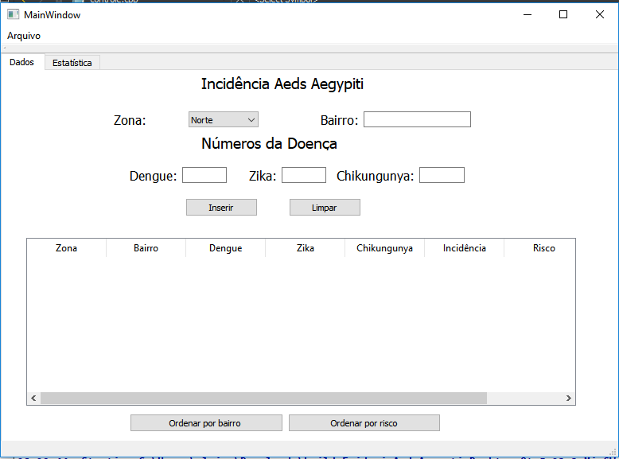

# Epidemic-Aeds-Aegypti

## Projeto que calcula a incidência do mosquito Aeds Aegypti, de acordo com dados das doenças Dengue, Zika e Chikungunya.

Através do Epidemic Aeds Aegypti podemos calcular o risco da incidência do mosquito Aeds Aegipti. A aplicação permite que o usuário insira a zona, o bairro e o número das doenças transmitidas pelo mosquito. A aplicação ordena por bairro e por risco.Abaixo podemos ver a tela inicial da aplicação.

O Epidemic Aeds Aegypti também possui uma tela onde apresenta suas estatísticas, na qual é possível saber a zona com o maior risco e a doença com a maior e menor incidência.

# Manual do Usuário

Para usar o aplicativo, o usuário deve inserir a zona, o bairro e o número das doenças catalogadas por cada bairro. Ao inserir, o programa faz o cálculo da incidência e apresenta se o risco é alto, baixo ou médio.

O projeto nos permite ordenar por bairro ou ordenar por risco. Caso queira, basta apertar no botão que fica abaixo da tabela.

Caso o usuário digite um bairro que já foi adicionado, uma mensagem na tela será acionada, informando que aquele bairro já foi cadastrado.

O usuário também pode editar na tabela a zona, o bairro e as doenças cadastradas.E de acordo com o que foi editado, uma nova incidência será calculada.

O usuário não tem permissão para alterar o risco e a incidência, pois eles dependem do cálculo que será realizado de acordo com os números das doenças.Caso o usuário tente editar, uma mensagem informando que não é permitido será acionada.

Além disso, se o usuário quiser limpar todos os dados inseridos, ele pode acionar o botão limpar.

Temos também a opção de salvar e carregar arquivos. Basta o usuário selecionar a aba de arquivos e escolher a opção salvar ou carregar.

